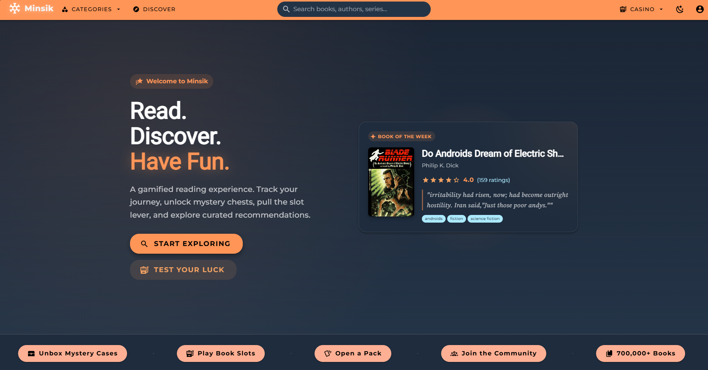
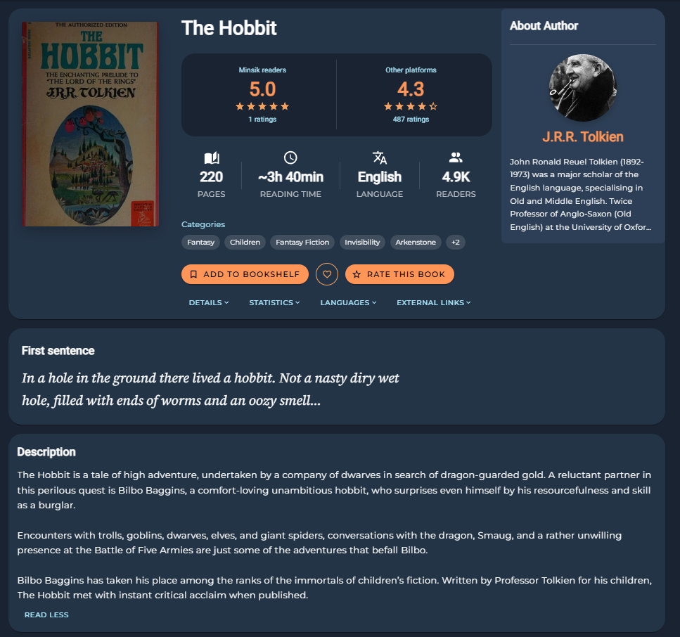
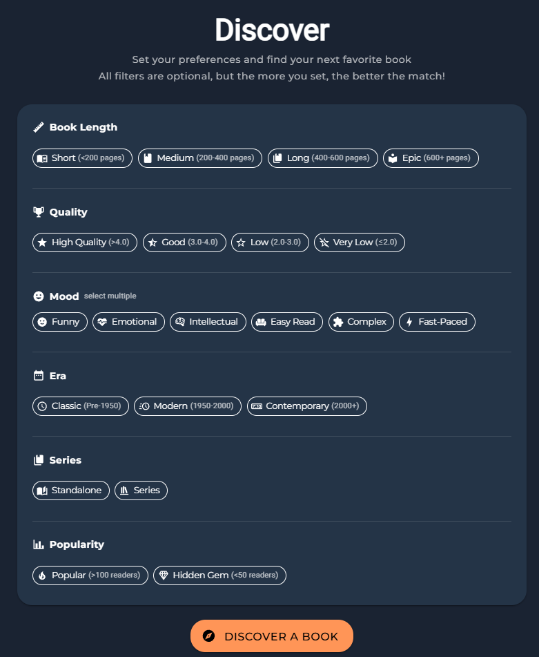
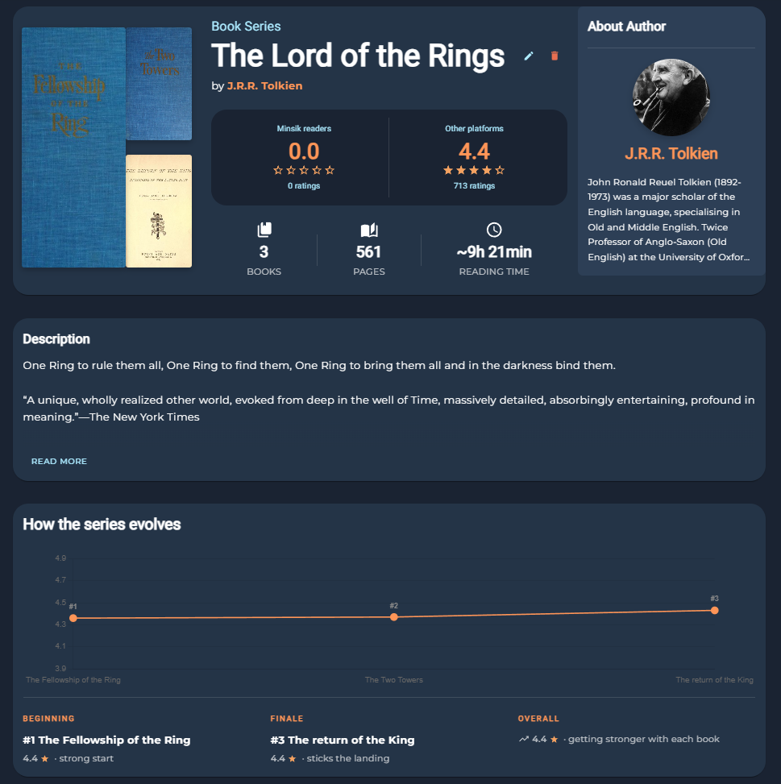
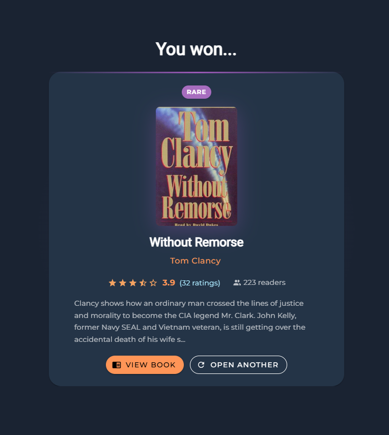
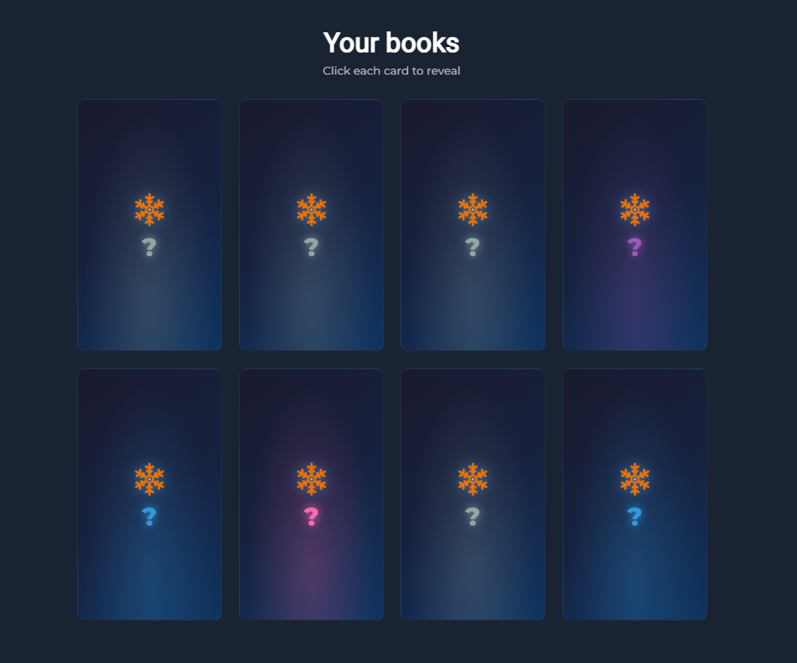

# Minsik

**A book discovery and tracking app.**

[](https://minsik.jtuta.cloud)
[](https://github.com/JakubTuta/Minsik-server)
[](LICENSE)

Minsik lets you track your reading, rate books across nine dimensions, and discover your next read — through smart filters, or by pulling the slot machine lever.

**[Live Demo](https://minsik.jtuta.cloud) · [Server Repo](https://github.com/JakubTuta/Minsik-server) · [Report Bug](https://github.com/JakubTuta/Minsik-web/issues/new?template=bug_report.md) · [Request Feature](https://github.com/JakubTuta/Minsik-web/issues/new?template=feature_request.md)**

---

## Screenshots


*700,000+ books to explore, a book of the week, and quick access to all Casino modes from the home page.*


*Each book shows an overall rating plus 8 sub-dimensions, estimated reading time, and a first-sentence preview.*


*Filter by mood, era, length, quality, and popularity — combine as many or as few filters as you want.*


*Series pages show how ratings evolve across books, so you know if it's worth finishing.*


*Book Slots — spin and land on a random book with collectible rarity tiers (Common through Legendary).*


*Open a Pack — reveal a themed set of books one card at a time.*

---

## What makes Minsik different

**Beyond star ratings** — Rate books across 9 dimensions: overall stars plus Pacing, Emotional Impact, Intellectual Depth, Writing Quality, Rereadability, Readability, Plot Complexity, and Humor. See what a book is actually like, not just whether people liked it.

**The Casino** — When you don't know what to read next, let chance decide. Pull the Book Slots lever, open a Mystery Case to reveal a book with a rarity tier, or crack open a themed Pack and flip cards one by one.

**Discover by feel** — Filter by mood (Funny, Emotional, Intellectual, Fast-Paced…), era (Classic, Modern, Contemporary), length, series or standalone, and quality threshold. Every filter is optional.

**Series tracker** — Series pages include an interactive rating chart showing how books score across the series, so you can see if it builds or fades before committing.

**Public bookshelves** — Every bookshelf is shareable at `/bookshelf/[username]`. Show what you've read, what you're reading, and what's coming next.

---

## Features

**Discovery**
- Full-text search across books, authors, and series
- Browse by genre via the Categories dropdown
- Rich author pages with biography, portrait, and full bibliography
- Series pages with cover collage and rating evolution chart

**Your Reading Life**
- Bookshelf with four statuses: *Want to Read*, *Reading*, *Read*, *Abandoned*
- Public bookshelves at `/bookshelf/[username]`
- Favourites list

**Ratings & Reviews**
- 9-dimension rating system
- Comments with optional spoiler flag
- Personal reading stats and personalized recommendations

**Casino**
- Book Slots — spin to discover a random book
- Mystery Cases — open to reveal a book with collectible rarity tiers
- Themed Packs — reveal a set of books one by one

---

## Getting Started

### Prerequisites

- [Bun](https://bun.sh/) (or Node.js ≥ 18)
- A running [Minsik server](https://github.com/JakubTuta/Minsik-server)

### Run locally

```bash
bun install
bun run dev
# → http://localhost:3040
```

### Environment variables

Create a `.env` file in the project root:

| Variable | Default | Description |
|---|---|---|
| `NUXT_PUBLIC_API_BASE_URL` | `http://localhost:8040` | Backend API URL |
| `NUXT_PUBLIC_SITE_URL` | `http://localhost:3040` | Canonical URL for SEO |

---

## Docker

```bash
docker build \
  --build-arg NUXT_PUBLIC_API_BASE_URL=https://your-api.example.com \
  --build-arg NUXT_PUBLIC_SITE_URL=https://your-app.example.com \
  -t minsik-web .

docker run -p 3040:3000 minsik-web
```

---

## License

Distributed under the [MIT License](LICENSE). Copyright © 2025 Jakub Tutka.
